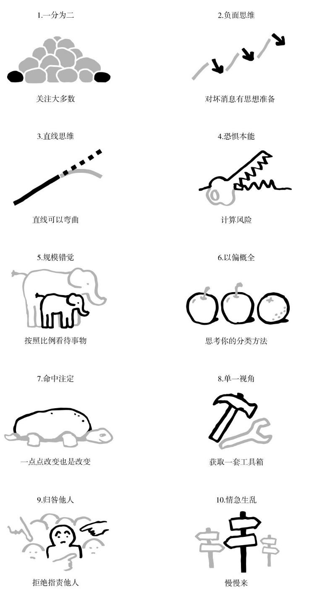
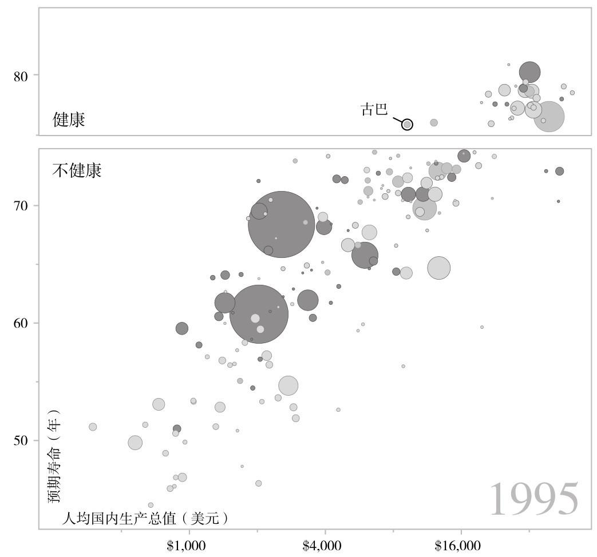
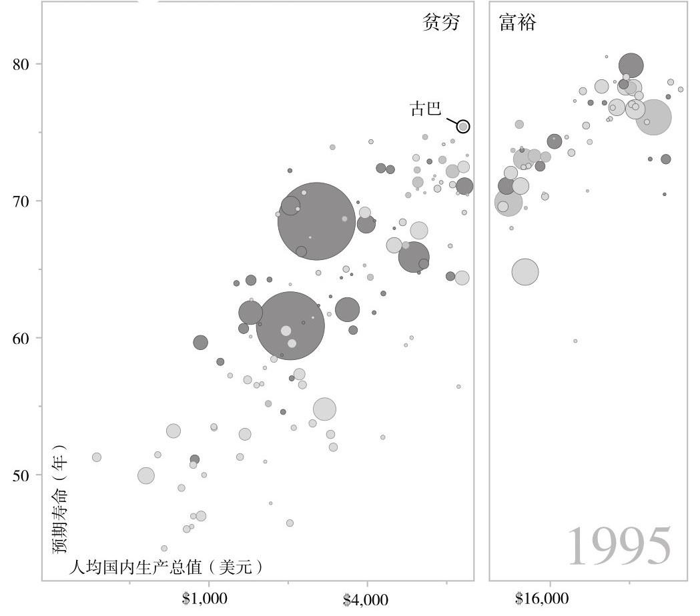
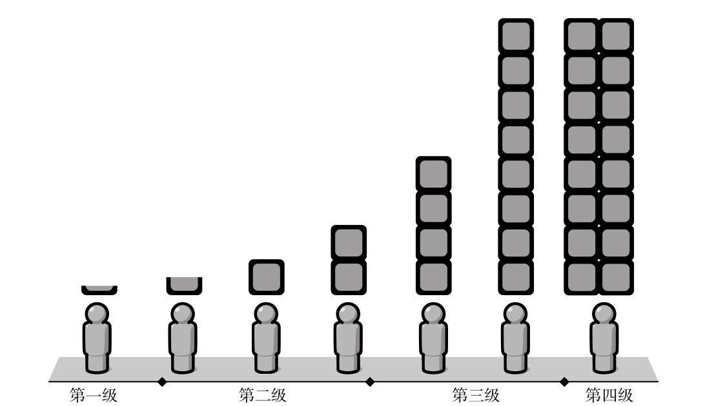

# 1.0.002 事实

## **引言**

我们情绪化的本能和过分情绪化的世界观

请不要误解我，我们今天仍然需要这些情绪化的本能。正是由于这些情绪的存在，我们的世界和人生才变得有意义。如果我们把一切都变成简单的、纯理性的输入分析以及决策过程，我们将失去正常的人生乐趣。

这本书讲述的是如何以数据作为根治无知的良方，以理性作为心灵平静的源泉。因为这个世界并没有你所感觉到的那么糟糕。

## **第一章 一分为二，是一种巨大的误解**

一分为二，是一种巨大的误解

**这张图有什么问题**

作者我是对的，你是错的，也不是种二分法吗？

 但绝大多数人口是生活在中间状态的。 “那么你凭什么这么说呢？”这位记者继续发问，而且明显是想激怒我。他确实成功了，我的语言和声音中都带着愤怒，回答他说：“我的结论是基于世界银行和联合国的统计数据，这是不具争议的，这些是无可辩驳的事实，所以我是对的，而你是错的。”

**大多数人在哪里**

正确的做法是我们停止把这个世界一分为二。这种方法现在已经不靠谱了。这种方法已经不再能帮助我们理解现实的世界，不再能帮助我们发现商业机遇，也不再能帮助我们把资金用来有效地援助世界上最贫穷的人们。

**一分为二**

这种一分为二的本能会误导我们，把平滑过渡当作两极分化，把和而不同当作分道扬镳，把求同存异当作矛盾对立。这是我们所介绍的第一个错误的本能，因为它是如此普遍，而且根本性地误导了我们对数据的理解。

**如何防范一分为二的错误本能**

当出现以下三种情况时，你要提高警觉，有人可能会告诉你（或者你自己认为）存在一个巨大的差距，并触发你一分为二的本能。这三种情况分别是：只比较平均数、只比较极端情况和只俯视不仰视。

**实事求是的方法**

要想有效地控制我们一分为二的错误本能，我们就要坚持寻找绝大多数。

* 我们要注意只比较平均数的做法。
* 我们要注意只比较极端情况的做法。
* 我们要注意只俯视不仰视的做法。

## **第二章 世界正在变得更坏，是一个重大的误解**

我们对坏事总会比好事更加关注。这种负面思维的本能就是我们重大误解背后的第二个原因。

我会认为这些数字是大致正确的，但是你不应该基于不到10%的差别而做出结论。（顺便说一下，在统计学里面，有一个很好的基本原则：当差别小于10%时，不要轻易做任何结论。

**统计学是一剂良方**

所以每当我们看到一个平均数的时候，我们就应该本能地想到，它的背后代表某一种数据的分布。

**32项其他重要的进步**

进入更高收入阶层的目的并不仅仅是得到更多的钱，延长寿命的目标也不仅仅是获得更多的时间，我们的终极目标是获得自由。

**负面思维的本能**

这种负面思维的本能体现在三个方面：第一，我们对过去错误的记忆；第二，媒体和社会活动家对于负面新闻的选择性报道；第三，我们总是觉得，只要有坏的事情发生，就不应该认为世界是在变好。

**如何控制负面思维的本能**

事情，可以是不好的，但同时也在变得更好。不好和更好可以是同时存在的。 这才是我们思考这个世界的正确方式。

**实事求是的方法**

要想控制我们的负面情绪，我们就要做到对坏消息要有思想准备。 

* 更好和不好。我们要学会区分状态和趋势，要认识到事情可以同时是不好的，但也是在变得更好的。
* 好消息不是新闻。好消息是很少得到报道的，因此我们总是听到坏消息。所以当你听到坏消息的时候，可以问一下自己是否我们没有听到好的消息。
* 循序渐进的进步不是新闻。当一件事情在持续变好，但当中产生了一些小的低谷的时候，通常你只会注意到低谷，而不是整体的趋势。
* 更多的坏消息并不意味着更多的坏事情。我们能够听到更多的坏消息，有时仅仅是因为我们对坏事情的关注度和监控能力提高了，并不意味着这个世界在变得更坏。
* 警惕过分美化的历史。人们经常会刻意地美化自己的历史，而国家也经常会刻意地美化自己的历史。

## **第三章 直线思维**

**我所见过最可怕的图表**

任何连续翻倍增长的东西，最终的增长都会远远比我们预测的快。

**直线思维本能**

线性回归就是假定趋势是直线发展，看来需要重新思考了

 这种能力在今天仍然在帮助我们生存。比如我们在开车的时候就会持续计算和预测周围的车辆在下几秒会出现在什么位置。 但是在现代生活中，我们的直线思维的本能并不总是一个可靠的工具。

但是在现代生活中，我们的直线思维的本能并不总是一个可靠的工具。当你观察一幅曲线图的时候，你会很自然地想象出曲线的末端按照一条直线自然延长。

但是当我们对另外一件事情不够熟悉的时候，我们将很容易假设它是按照直线发展的，而忘了考虑这种假设很可能是愚蠢的。

**人口曲线的形状**

要想理解人口曲线的形状，我们首先需要理解人口的增长究竟是从哪里来的。

比尔·盖茨和他的夫人梅琳达共同发起了一个慈善基金。他们已经在全世界各地投入了几十亿美元，投资于基础医疗设施和基础教育，从而把大量的儿童从极度贫困状态中拯救出来。但是总会有一些怀着美好善意的人去劝阻他们。这些人说，如果你持续拯救贫困儿童，这个世界上将会有越来越多的人口，地球将不堪重负。

“拯救贫困儿童会使得世界人口一直持续增长”这种说法看似正确，实则是错误的。恰恰是生活在极度贫困状态中的人们才使得世界人口持续增长。他们中的每一代人都持续生育更多的孩子。控制人口增长的最有效手段，就是把人们从极度贫困状态中拯救出来，使他们得到更好的生活，包括基本的教育和避孕手段。一旦脱离了极度贫困状态，世界上的父母毫无例外都选择了生育更少的孩子。这种转变在全世界范围内都在发生，而且毫无例外地，都伴随着儿童死亡率的下降。

**如何控制直线思维**

控制直线思维本能的最佳方式，就是每当我们看到一条直线的时候，我们就应当想到事物的演变有多种方式，不一定是按照直线发展的。

* 直线
* S形曲线

  记住S形的曲线，这有助于帮助你提高对这个世界的认识。在收入水平的第二级，几乎所有人的基本生活都可以得到满足。

* 滑梯曲线
* 驼峰曲线

  所以牙齿健康状况不好，对于收入水平处于第四级的人来说，代表着相对贫穷，而对于收入水平处于第一级的人来说，则恰恰相反，代表着相对富有。

* 倍增曲线

  我刻意按照收入的翻倍增长来划分四个不同的收入水平，是因为收入增长就遵循了这样的规律。对于不同收入水平的人来说，额外的一美元收入带来的影响是完全不一样的。对于第一级的人来说，每天多挣一美元就可以买到更多的水桶，给人们的生活带来巨大的好处。但是对于收入水平在第四级的人来说，他们每天平均可以挣64美元，多挣一美元并不能影响什么，但是如果每天能够多挣64美元，他就有能力建个游泳池或者买度假小屋，这同样对生活水平有巨大的影响。这个世界是极度不公平的，但是对于绝大多数人来说，收入水平翻倍都会带来生活水平的巨大提升。这就是我用翻倍曲线来划分人类收入水平的原因。

**实事求是的方法**

要做到实事求是，就需要认识到我们不能假设事物总是按照直线发展的，并且我们要记得，直线发展的事物在现实中是很少见的。要想控制直线思维的本能，我们就需要记住，自然界有很多不同的曲线形状。

## **第四章 恐惧本能**

**血流遍地**

理性思考永远是困难的，尤其当我们恐惧的时候。当我们的思想被恐惧填满的时候，我们的大脑就没有空间来思索事实了。

**注意力的过滤机制**

由于我们情绪化的思维本能，以及媒体必须利用我们的情绪化本能来捕获我们的注意力，我们一直拥有一种过度情绪化的世界观。在所有情绪化的本能中，恐惧本能最能影响媒体对于传递给大众的新闻的选择。

**恐惧本能**

然而这里出现了一个悖论：当现实世界变得前所未有的和平和安全的时候，我们看到的却是铺天盖地的关于各种危险的报道

**自然灾害**

当今社会死于自然灾害的人数急剧减少并不是因为自然环境改变了，而是因为绝大多数人今天并不生活在极度贫困状态下。在不同收入水平的国家都会有自然灾害发生，但是灾害带来的实际伤害却非常不同。收入水平高的国家就会采取更多的预防措施

在这种时刻，我们必须忘记宏观的趋势，并且竭尽所能去提供帮助。必须等到危机过去之后，再思考事实和宏观趋势。那时我们必须重新建立实事求是的世界观，我们必须冷静下来并且对数字进行分析，从而能够在未来更好地利用我们的资源，防止更多的伤害。我们不能被恐惧驱使着采取行动。由于有国际协作的存在，我们最恐惧的那些危险，往往是不能对我们造成多大伤害的。

**4000万架次看不见的飞机**

从那时起，按照全世界统一的标准，每一起空难事故都会被调查、被报道，风险因素都会被系统性地分析，安全流程也得到改善。多么伟大呀！我认为芝加哥会议是人类历史上最伟大的全球合作之一。当有着共同恐惧的时候，我们会看到人们可以如此亲密无间地一起合作。

**污染**

在世界上的很多地方，自然环境正在恶化。但是正如地震比痢疾得到更多的媒体报道和关注一样，化学物质的污染比一些更有害的环境恶化，比如逐渐死亡的海床和过度捕鱼，得到了更多的关注。

**恐怖主义**

结果我们却发现维基百科在不经意间制造了一种扭曲的世界观，而且这是一种从西方人视角产生的系统性的扭曲。准确地说是78%，维基百科资料中的死亡人数少了78%。几乎所有发生在西方国家的恐怖主义袭击导致的死亡都被记录了下来，但是在世界其他国家发生的恐怖主义袭击导致的死亡，只有25%被记录了下来。

**恐惧vs．危险：对真正危险的事情感到恐惧**

因为恐惧和危险是两个不同概念。可怕的事情，仅仅给了我们一种危险的感觉，但是另外一些真正危险的事情则会威胁我们的生命。过度关注可怕的而不是危险的事情，就意味着我们把自己宝贵的注意力放在了错误的方向。

**实事求是的方法**

风险=危险程度×发生的可能性。你面临的真实风险，并不取决于它看起来多么吓人，而在于两个因素：危险的程度和发生的概率。

## **第五章 规模错觉**

**看不见的死亡**

我真心认为在绝大多数人口还没有获得基本医疗条件的时候，在98.7%的死亡儿童都死在医院之外的时候，把有限的资源和精力过度地投入在医院是一种不道德的行为。所以我们集中精力去培训乡村健康工作者，这样才能让尽可能多的孩子得到疫苗注射，也能使那些刚刚患病的孩子在第一时间就在附近的乡村诊所得到最及时的治疗。这就是在极度贫困生活状态下的残酷的统计数字。也许人们会觉得我无视眼前个别病危的儿童而去关注我看不见的几百个垂死的儿童，是一种不人道的行为。

看很多朋友谈到了电车难题，没有更好的解决办法。但从宏观方面看，我们只能降低电车难题发生的概率，以及减少损失，正所谓防患于未然

 而这时我总会想起我原来的导师罗素女士的话。她曾经在刚果和坦桑尼亚作为教会护士工作过很多年。她总是说：“在极度贫困状态下，你不可能也不应该把事情做得完美。如果你这么做，你就是在从其他更需要这些资源的地方窃取资源。” 当我们过度地把精力集中在可见的局部而忽略了不可见的整体的时候，我们就会错误地把资源投入一小部分问题上面，从而只能拯救一小部分人的生命。这一原则适用于所有资源紧缺的情况。面对拯救生命的问题，我们很难来讨论资源的分配，因为这样会让人觉得我们冷酷无情。

“在极度贫困状态下，你不可能也不应该把事情做得完美。如果你这么做，你就是在从其他更需要这些资源的地方窃取资源。

当我们过度地把精力集中在可见的局部而忽略了不可见的整体的时候，我们就会错误地把资源投入一小部分问题上面，从而只能拯救一小部分人的生命。

但是只要你仔细地思考一下，你就会同意，研究出最经济有效的方法，从而能够拯救最多的儿童生命，这才是最有良心的做法。

**规模错觉**

人们总是容易注意局部而忽略整体。这是我们的本能之一。我们总是会注意到一个单一的数字而误判它的重要性。

几乎所有儿童生存率的提升都是通过医院之外普及性的、预防性的医疗措施实现的，都是那些乡村护士、乡村医生和受到教育的父母带来的。尤其是受教育的母亲们。数据表明，在全世界范围内，几乎一半以上的儿童生存率的提高是来自母亲获得了读书和写字的能力。今天更多的儿童能够生存下来，是因为预防性的措施使他们更少得病。受过培训的乡村医生可以给怀孕的母亲们照顾和接生。

**如何控制规模错觉**

数字对比要想避免对事物重要性的误判，最重要的事就是不要只看单一数字。永远不要认为单个数字本身就有很大的意义。当你看到一个数字的时候，你应该马上想到用它和其他的数字做对比。

**二八原则**

这就是二八原则。我们总是倾向于认为在清单上的所有事情都同样重要，但是通常其中几件事的重要性就远远超过了其他所有事情的总和。 

是的，我认为西方世界统治下的全球经济将很快结束。生活在北美洲和欧洲的人们需要认识到，世界上绝大多数人生活在亚洲。从经济潜力的角度来看，“我们”只代表20%，而不是80%。但是我们中的很多人并不接受这个现实。我们不但误判了越南战争在越南人心目中的重要性，也误判了我们在未来全球市场中的重要性。我们中的很多人忘记了如何和未来市场的主人打交道。很快，非西方人将占第四级人口的大多数

**研究比例**

通常我们要想理解一个看起来很大的数字的真实含义，我们最好把它除以一个总数。在我的工作中，这个总数通常是世界人口。

**对比和比例**

每当我看到报道中单一的数字的时候，我都会引起警觉：这个数字应该和什么数字做比较呢？这个数字一年前是多少？十年前呢？它在其他国家是什么样？这个数字除以什么数字才能得到一个有意义的比例呢？这个数字是什么数字的一部分吗？这个数字如果考虑人均的话是什么情况？然后我会比较各种比例，我才可以明白这个数字究竟是否重要。

**实事求是的方法**

* 对比。大的数字总是看起来很大，而单一数字很容易误导我们。当我们看到一个单一数字的时候，一定要记得做对比，或者做除法，得到某种比例。
* 二八原则。如果你得到了一个长长的清单，就应该先排序，然后找到最大的几项并且做深入分析。通常这几项的重要性要远大于其他所有项目加在一起的重要性。
* 比例。数字和比例有可能代表着完全不同的含义。尤其当我们在不同大小的组别之间做对比的时候，比例总是更有意义。具体来讲，我们在对国家和地区进行比较的时候，应该更加关注人均数字。

## **第六章 以偏概全**

**晚餐准备好了**

无论什么地方，无论什么人，他们都知道，从不同的地域来的人会有不同的风俗习惯。

**以偏概全的本能**

一分为二的本能促使我们把世界分为“我们”和“他们”，而以偏概全的本能使得“我们”认为“他们”是完全一样的。

但所有的这些幻想和努力都是无济于事的。就像在其他任何一个饱和的消费者市场一样，基本的需求早就已经得到了满足。

真正有效的商业策略，需要建立在实事求是的世界观的基础上，才能够发现未来的客户在哪里。

**找到更好的分类方法：收入大街**

你可以去谷歌搜索厕所、床或者火炉。你会得到大量的收入等级在第四级的图片。如果你想看到收入等级在其他级别的人是如何生活的，你是很难通过谷歌来找到图片的。

**质疑你的分类方法**

下面我向你介绍五种非常有效的工具，能够帮助你来质疑自己的分类方法。注意同类别事物间的不同之处，以及不同类别事物间的相似之处；注意大多数；注意极端案例；假设你自己并不具备一般代表性；注意以偏概全地把一个类别的特征推广到其他类别。

寻找同一类别内的不同之处寻找不同类别之间的相似性

当大家习惯用国家来进行分类定性的时候，如果我们注意到同一国家之中不同人之间生活水平的巨大不同，以及不同国家之间相同收入水平的人们的生活的巨大相似性，我们就会很容易得出结论，按照国家来进行分类讨论是不准确的。 

注意大多数当我们说一个群体中的大多数拥有某些特征的时候，请记住，大多数只是意味着超过一半。它有可能代表51%，也有可能代表99%。请尽可能地问具体的百分比。

注意极端案例我们应当注意用极端案例来以偏概全的情况。

如果某些人给了你一个例子，然后试图向你说明这个例子的结论适用于整个类别的话，你应当让他举出更多的例子。或者你可以问他能否举出一个反例来得出相反的结论。

假设你自己并不具备一般代表性，而其他人也不是傻瓜

萨尔希一家和其他生活在相似环境的家庭一样，找到了非常聪明、一石数鸟的解决问题的方法。对于收入水平在第二级和第三级的家庭而言，他们通常不能去银行存款或进行贷款。所以当他们想改善自己的住房条件的时候，他们必须把现金存放在家里，而现金很容易被偷或者在通货膨胀中损失价值。所以他们决定买来砖头和瓦片，这样就不会损失现金的价值。但是砖头和瓦片如果放在房子外面，也有可能被偷。而房屋里面是没有空间来存放这些砖头瓦片的。所以他们决定买来砖头瓦片的同时就盖到房子上面。这样小偷就不可能把它们偷走了。而通货膨胀也不会折损这些砖头瓦片的价值。在这个过程中，也不会有信贷员跑来检查你的信用等级。通过这种方式，你在10到15年间，慢慢地，逐步给你的家庭盖了一座更好的房子。所以你不应当假设这些人是懒惰和没有计划性的。相反地，你应该问，他们怎么能够想出如此聪明的解决办法？

不要以偏概全地把一个类别的特征推广到其他类别

**实事求是的方法**

要想控制住我们的以偏概全的本能，我们要经常质疑自己的分类方法。 

* 在同一类别中寻找不同。特别是当一个类别非常巨大的时候，我们应该试图找到有效的办法来将其分得更小、更准确。
* 在不同类别中寻找相同。如果你发现不同的类别之间存在着巨大的相似性，那么要考虑，你的分类方法有可能是不正确的。
* 在不同类别中寻找不同。不要假设在一个类别中适用的规则可以
* 在其他类别中同样适用。比如收入水平第四级的人不要假设其他级别的人也适用同样的生活规则。再比如失去意识的士兵和沉睡中的婴儿是不同的。
* 注意大多数。大多数仅仅意味着超过一半，我们应当具体区分，大多数究竟意味着51%还是99%。
* 注意极端案例。活灵活现的图片往往会给我们留下深刻的印象，但是它们有可能只代表着极端案例，而不是普遍现象。
* 不要假设别人是傻瓜。当你发现一些奇怪现象的时候，请保持好奇心和谦卑之心，去探究这现象背后的道理。

## **第七章 命中注定**

**太阳从西边出来**

“我们绝大多数客户无法看到或者接受非洲国家的进步。在他们的心目中，非洲就是一个永远都不可能进步的大陆。我们希望你能通过图表和数据改变他们僵化的思维。”

**命中注定**

所谓命中注定本能，就是我们认为一些事物内在的属性将决定其命运，无论是人民、国家、宗教还是文化。这种思想认为所有的落后都是他们的内在本质造成的，而这一点是永远不会改变的。

我们可以很容易地找到这种本能的进化史根源。在历史上，人类生活在相对稳定、很少改变的环境中。认识到环境的稳定性，并且假设这种稳定性会持续存在，对于人类的生存是很重要的。

同时为你所处的特定群体宣称一种所谓的命运，也将有利于将这个群体团结在一起，并且产生一种优越感。所以这种命中注定的本能对于强权部落和独裁统治都是很重要的。但是在当今社会，这种认为事情一成不变的本能将阻止我们学习新的知识，并且会使我们忽视在现实社会中发生的天翻地覆的变化。

社会和文化并不像岩石一样不可改变。它们是在持续变化中的。以西方社会为例，我们的社会和文化也改变了很多。非西方的社会和文化也在持续变化当中，只是所有的这些变化都是逐渐发生的，因而不值得被媒体大肆渲染报道。比如互联网、智能手机和社交媒体的普及，已经给我们的社会和文化带来了巨大的变化，但是我们却很少能够从媒体上看到太多的报道。

我的很多欧洲同僚都有一种自以为是的情绪，他们认为欧洲的文化不光比非洲和亚洲的文化更加先进，也比美国的消费文化更加优越。从结果来看，26%的美国公众选对了答案，而西班牙和比利时只有13%的人选对了，芬兰答对这题的比例是10%，挪威回答正确的人数只占了8%。

**岩石是怎么移动的**

但是90年前，在瑞典也有极度贫困的人。在我年轻的时候，大约50年前，中国、印度和韩国在大多数方面都比今天的非洲国家更差。那个时候人们也认为亚洲是命中注定不会发展起来的。那时候人们总会说它们绝对不可能养活40亿人口。

他们想要脱贫，当然会面临非常大的困难，但并不是因为他们无法改变的文化，而是因为土壤和战争。

这个预测很重要的另外一个原因是，如果你在一家西方的大公司工作的话，你将有可能错失人类有史以来最大规模的中产阶级消费市场。而这个市场正在亚洲和非洲形成。亚洲和非洲的本地品牌已经逐步站稳脚跟，有了一定的品牌认可度，并且在世界范围内扩展业务，这时你却仍然对非洲和亚洲所发生的进步一无所知。相比非洲和亚洲的新兴市场而言，西方的消费市场几乎只是一个零头。

**收入越高，婴儿越少**

在今天，伊斯兰教妇女平均生育3.1个儿童，而基督教的妇女平均生育2.7个。从生育率上来说，世界上最大的两大宗教之间并没有显著差别

人们总会夸大其词地说有某种宗教信仰的人会倾向于生育更多的孩子。而这种生育选择是与文化和价值观相关的，是不可改变的。这是非常错误的，价值观随时都在改变。

我们在亚洲和非洲的一些国家发现的大男子主义的价值观并不是亚洲的价值观或者非洲的价值观，也不是伊斯兰教的价值观，也不是东方的价值观，这和60年前瑞典的价值观一样，只是一种历史上的大男子主义的价值观。随着社会和经济的进步，这种价值观会自然消失，正如在瑞典发生的一样，这些价值观并不是不可改变的。

**如何控制命中注定本能**

缓慢地变化并不是没有变化

要想控制命中注定的本能，就要注意不要忽视微小的改变。不要轻易忽略每年的变化，尽管这个变化可能仅有百分之一。

准备好随时更新自己的知识

和老年人对话

收集文化改变的案例

**实事求是的方法**

要想控制命中注定的本能，就要记住缓慢的改变也仍然是改变。 

* 注意追踪持续的提高。每年小的改变可以在几十年后积累成巨大的改变。
* 更新你的知识。有些知识很快就会变得过时，技术、国家、社会文化和宗教都在持续的改变当中。
* 与老年人对话。如果你想弄清楚价值观是如何改变的，请想一想你的祖父母们的价值观和你的价值观有什么不同。
* 收集文化改变的案例。找到反面的案例来挑战那种认为文化一成不变的说法。

## **第八章 单一视角**

**单一视角本能**

如果你总是执着于或迷信于某种特定的想法，那么你就会自动忽略不符合你想法的信息。这不是一种能够帮助你认识真相的方法。相反，你应该持续地测试自己的想法的不足之处。对你自己有限的经验采取谦卑的态度，积极获取最新的信息。对你专业领域之外的知识要保持好奇心。要多和拥有不同意见的人交流，把这些不同意见看作帮助你真正理解这个世界的有用的资源，而不是仅仅和那些和你有共同观点的人一起交流。

为什么人们总是习惯于用单一视角去理解这个世界呢？我发现了两个主要的原因：其一是政治的意识形态，这一点我在后面会继续介绍；其二是专业局限性。

**专业人士：专家们和社会活动家们**

我曾经非常荣幸地参加了第64届林道诺贝尔奖得主大会，并且为一群极具天赋的物理学家、化学家以及诺贝尔奖得主来做演讲。他们都在自己熟悉的领域是顶尖的专家，然而关于儿童疫苗注射率这个问题，他们的正确率比普通人还要低，仅有8%的人选择了正确答案。从那以后我就再也不相信专家们能够在他们擅长的领域之外有任何权威性了。拥有高智商，数学很好，受过高等教育，甚至得过诺贝尔奖，这些都不能确保你能更正确地认识世界。有些时候，所谓的专家甚至在他们自己专长的领域也不够专业。

人们知道了所取得的进步，就会受到很大的激励，而反复地强调问题的存在，却不会给人们带来任何激励。联合国教科文组织、拯救儿童运动、组织人权运动和环保运动的人，他们都一而再、再而三地错失了这样激励公众的良机。

**锤子和钉子**

知识有时候会成为专家的障碍，使他们看不到真正的解决方案。所有的解决方案，对于解决特定的问题都是很管用的，但是没有任何一种方案可以解决所有的问题。最好的方法就是以多视角来观察这个世界。

数据并不是唯一的解决方案我并不热爱数据。虽然我喜欢研究大量的数据，但是我并不热爱数据本身。数据是有它自己的局限性的。仅仅在数据能够帮助我理解数字背后的现实的时候，我才会喜欢使用数据。

我们可以用数字来描述人们在疾病中遭受的苦难，我们也可以用数字来衡量人们物质生活的进步，但是经济增长的终极目标是个人自由以及文化。而这些是无法用数字表达的。试图仅仅用数字来衡量人类的进步是一个很奇怪的主意。数字永远不能够反映人类生活的全貌。

没有数字，我们不可能理解这个世界，但是这个世界也不可能仅仅通过数字来理解。药品并不是唯一的解决方案

**意识形态主义者**

人民的共同信仰，也就是意识形态，可以使我们建造现代社会。意识形态使得我们拥有了民主自由和公共卫生保险。

如果我们认真研究古巴和美国人的现实生活状态的话，我们就会发现，专注于单一视角的意识形态主义者们往往会得出荒谬的结论。他们总是相信单一的解决方案，例如自由市场或平等这些意识形态是解决一切社会问题的万灵药，而不是去客观地观察不同的意识形态下产生的现实结果。

你的数据都是正确的，但卫生部部长的结论却是错误的。我们不是穷国中健康水平最高的国家，而是同等健康水平的国家中最穷的。

                                      古巴——最健康的穷人

                                            古巴——最贫穷的健康者

                              对价格差异做了调整。来源：World Bank\[1\], IHME\[1\] & UN-Pop\[1\]

意识形态主义者们从他们自己的单一视角出发，通常会要求你对比古巴和美国。他们会坚持说，如果你认为美国比古巴更好，你就应该反对古巴所做的一切，你就应该支持自由市场经济。我声明，如果让我选择的话，我当然会优先选择在美国生活，而不是在古巴。但是我并不认为这种单一视角和非此即彼的思维方式是正确的。如果要比较的话，我不认为美国应该和收入水平还处在第三级的古巴这样的社会主义国家做对比，而应该和其他收入水平在第四级的资本主义国家做对比。如果美国的政治家们希望做出实事求是的决策的话，他们不应该仅仅从意识形态出发，而应该从现实的数据出发。如果让我选择在哪里生活的话，我不会根据意识形态进行选择，而会基于这个国家究竟给它的人民带来了什么而做选择。

古巴的共产主义系统代表了一种单一视角的风险：他们认为一个中央政府可以解决人民的所有问题，这个理念看似理性，实则奇怪。我可以理解，当人们看到古巴的贫穷、缺少自由和效率等现状之后，会认为政府永远都不应该参与到社会规划中来。

在大家讨论自由市场或是政府干预的话题的时候，答案不应该是绝对的是或者否，而应当具体问题具体分析。真正的答案不应该是非黑即白，而是应该在监管和自由之间取得一种平衡。

任何人如果想强调民主是经济增长和健康水平提高的必要条件的话，都无法在现实中找到足够的依据。所以我认为与其把民主当作一种取得进步的手段，还不如把民主当作国家奋斗的目标。

没有任何一种单一的手段或者指标能够必然地带来其他各个方面的进步。无论是人均GDP、婴儿生存率，或者个人自由，甚至民主，通通不是万灵药。没有任何一种单一的指标可以衡量一个国家的进步。现实永远是复杂的。

没有数字，我们无法了解这个世界，但是仅仅依靠数字，我们也无法了解这个世界。没有国家能够在无政府状态下持续，然而政府也不可能解决一个国家的所有问题。无论是自由市场或者政府干预，都不会成为永远正确的答案。也不会有任何一种万能的解决方案可以自然而然地带动社会的所有方面进步。永远不会有非黑即白的答案，我们永远需要因地制宜的选择。

**实事求是的方法**

要想控制单一视角的本能，必须有一个工具箱，而不仅仅是一把锤子。

* 检查你的想法。不要仅仅专注于那些能够证明你的想法的正确案例，而要多与那些持有不同意见的人讨论。发现自己想法的不足之处。
* 有限的经验。不要认为你在自己的专业领域之外有什么真知灼见。对自己未知的领域要保持谦逊。同时也要注意到专家也有他们的局限性。
* 锤子和钉子。当你会熟练地使用某一种工具的时候，你总会尽可能多地使用它。等你花了太多的时间专注于分析某一个问题的时候，有可能会夸大这个问题以及解决方案的重要性。请牢记，没有任何一个工具是万能的。如果你总是习惯于使用锤子的话，那么请多和那些习惯使用改锥、扳手和卷尺的人打交道。多听听来自不同领域的人的意见。
* 关注数字，但不仅仅关注数字。没有数字，我们无法理解世界，但是仅有数字，我们仍然无法理解世界。请专注于发现数字背后的真实世界。
* 当心简单的想法和简单的解决方案。人类历史上从来就不缺乏充满了乌托邦式的简单想法的空想家，而最终他们都带来了可怕的结果。我们应当认识到事物的复杂性，学会兼收并蓄以及妥协。我们应当在具体情况具体分析的基础上来解决问题。

## **第九章 归咎他人的本能**

当坏事情发生的时候，人们总是试图找到一个清晰而简单的理由去责怪其他人，这就是我们所说的归咎于人的本能。

当有坏事情发生的时候，我们似乎总是很自然想到，一定是有其他人故意做坏事。我们总是倾向于相信有人利用权力或者手段，才能够使得事情发生，否则的话，这个世界就会让人感到不可预测、令人困惑和非常可怕。

归咎他人的本能使我们夸大了个人或某个团体的重要性。这种本能总是驱使我们去找到一个被责怪的对象，而使我们忽略了对这个世界的真相的理解。当我们过分执着于指责他人的时候，我们就会迷失自己的重点，同时丧失了学习能力。像前面的例子，当我们的注意力集中在思考究竟该揍谁的时候，我们就会停止思考问题产生的真正原因。这就大大地降低了我们真正解决问题或者预防问题的能力。

对世界上的绝大多数问题而言，我们不能停止于找到替罪羊，而应该观察理解产生问题的整个系统。当事情向好的方向发展的时候，这种本能往往也会被激发出来。我们通常会认为是某个人、某个团体或某个简单的原因，造成了这一好的结果，而忽略了背后复杂的真相。

**指责他人的游戏**

对他人的指责往往能够揭示我们自己的思维模式。当我们在寻找替罪羊的时候，其实反映的是我们内心早已存在的思维模式。让我们看看我们经常习惯于责备的几个人群：无良的商人、说谎的记者以及外国人。

最近社会又在反对某些所谓的无良商人，但是却忘记了他们给我们生活带来了多大的便利。什么因素影响了大众判断呢？

 让我们看看我们经常习惯于责备的几个人群：无良的商人、说谎的记者以及外国人。 无良的商人 我总是希望自己能够尽量客观地分析和思考问题，但是尽管如此，我也经常被自己的本能所淹没。可能是因为我看了太多动画片，受到了唐老鸭那富有又贪婪的舅舅的影响，使我倾向于认为商人总是贪婪的。在我年轻的时候，我也会像我的那些学生一样，简单地把缺乏药品的问题归咎于大型制药厂的贪婪。很多年前，当联合国教科文组织要求我去对一起合同招标（安哥拉的疟疾疫苗项目）

在这里我不打算讨论那些刻意制造假新闻的事件，因为那和我们想要说的主题无关，而且我也不认为是那些假新闻造成了我们扭曲的世界观，因为我们并不是刚刚开始对世界产生错误的认识，而是一直以来我们对世界的认识都是错误的。

相反地，我们应该去寻找答案，究竟为什么记者们会有这样一个扭曲的世界观？（答案是因为他们也是常人，他们也有着夸大事实的本能。）以及哪些系统性的因素会促使他们去推广这样扭曲的世界观和过分夸大的新闻？（至少一部分的答案是，他们必须和其他的媒体竞争读者的注意力。）当我们彻底理解了这点之后，我们就会认识到，要想让媒体改变他们报道世界的方式从而向我们反映一个真实的世界，几乎是不可能的。

事实是，他们买得起机票，他们的飞机也有很多座位，但是在登机的柜台，航空公司的工作人员阻止了他们，不允许他们上飞机。为什么呢？因为欧洲议会从2001年起就决定打击非法移民。这项决议规定任何航空公司或者渡轮公司，如果他们送来了入境手续不全的非法移民的话，他们必须负担把这个人遣送回国的所有费用。当然这项决议也明确地表示并不适用于那些受日内瓦公约保护的逃到欧洲的难民，而仅仅适用于非法移民。然而这种规定是毫无意义的，因为在航空公司的登机柜台，工作人员仅仅有45秒的时间来判断面前的人究竟是非法移民还是难民，这种事儿即使是大使馆也要花8个月才能做出判断。这明明是不可能的事。所以对所有的航空公司和渡轮公司而言，最现实的方法就是拒绝没有签证的人登机或登船。然而对于难民来说，要想获得一张去欧洲的签证，几乎是不可能的。因为在土耳其和利比亚的欧洲大使馆，并没有足够的资源来处理这些签证申请。从叙利亚来的难民们，虽然理论上拥有到达欧洲并获得庇护的权利，但事实上他们根本没有办法坐飞机或者渡轮到达欧洲，而偷渡则变成了唯一的选择。

大气层中积累的二氧化碳气体都是在过去的50年间由那些收入水平进入第四级的国家排放的。加拿大的人均二氧化碳气体排放量仍然是中国的两倍、印度的八倍。事实上，你知道每年燃烧掉的化石燃料中有多少是由全球最富裕的10亿人燃烧的吗？超过一半。然后全球次一等富裕的10亿人，烧掉了剩余化石燃料的一半。以此类推，世界上最贫穷的10亿人用掉的化石燃料，只占全球的百分之一。按收入计算CO2排放量：

外国的疾病人体最大的器官就是皮肤。在现代的特效药被发明出来之前，最恐怖的一种皮肤病就是梅毒。一开始患者只是觉得皮肤很痒，然后这种皮肤病就会逐渐向内部侵蚀肌肉和骨骼，直到人体的骨架。这种可怕的疾病在不同的国家被称作不同的名字。在俄罗斯，它被称作波兰病；在波兰，它被称作德国病；在德国，它被称作法国病；在法国，它被称作意大利病；在意大利，他们称之为法国病。

当堕胎被认定为非法的时候，它并不能阻止堕胎，而只是把人们驱赶向了更加危险的堕胎方式，并且增加了妇女的死亡率。

**真正的英雄**

我们应当为它们游行庆祝，这两位无名英雄就是组织机构和科学技术。

除非你愿意放弃所有这些东西，重新开始用手洗你的牛仔裤和你的床单，否则你没有任何权利要求别人去这样生活，难道不是吗？仅仅寄希望于找到替罪羊来责备，并且希望他们来为气候变暖承担责任是于事无补的，倒不如我们认真研究一个现实可行的方案来解决气候变化问题。我们必须集中精力研究新技术，使得地球上未来的110亿人都能够共同奋斗而进入收入水平的第四级。

**我们应当责备谁呢**

事实上，我们不应当为任何事责怪任何一个个人或团体。原因是当我们找到了替罪羊的时候，我们就停止思考了。而事实往往非常复杂，往往存在系统性的原因。如果你真的希望改变这个世界的话，你必须深刻地理解它的运行规律，而不是简单地考虑究竟该责怪谁。

**实事求是的方法**

要想控制归咎他人的本能，你应该停止寻找替罪羊。 

* 寻找原因，而不是寻找坏人。当坏事情发生的时候不要试图去责怪任何个人或群体。首先接受没有人刻意为之这个事实。然后努力去理解这一事情发生背后的系统性原因。
* 寻找系统，而不是寻找英雄。当有人号称自己做了什么伟大的业绩的时候，问问自己，如果没有这个人，是否这件事情仍然可以发生？通常是整个系统的有效运行使得好的事情发生了。

## **第十章 情急生乱**

**路障和心理障碍**

当我们陷入恐惧中，并且在紧迫的时间压力下，我们就会过分地思考最坏情景，于是做出非常愚蠢的决定。在事出紧急的压力下，我们的分析能力就会丧失。

**情急生乱的本能**

他们采用的都是一种相同的技巧：现在行动，否则你将永远失去机会。他们都是在故意激起你情急生乱的本能。要求你立即采取行动所带来的紧迫感使你不能全面地思考，使你更快地做出决定并采取行动。请放轻松，这永远都不是真的，事情永远都没有那么紧急，而且事情永远不是非黑即白的选择。你完全可以把这本书放下，去做其他的事，过一个星期或一个月，甚至一年，你再回来，拿起这本书，重新看一看里面的主要观点，那也不会太晚。与其囫囵吞枣似的学习，还不如细嚼慢咽。情急生乱的本能使得我们在感知到危险的时候，就立即采取行动。在遥远的过去，人类的祖先必须拥有这种本能。如果人们看到有一头狮子在远处的草丛中，他们应当立即逃跑，而不是做很多分析工作。那些不能快速反应而是停下来仔细分析各种可能性的人类，早已经灭绝了。我们的祖先一定是那些能够在不充分的信息下快速反应且快速行动的人类。在当今社会，我们仍然需要这种紧急反应的本能，比如说当一辆车突然向我们驶来的时候，我们必须迅速做出躲避动作。但是在现在的社会中，我们所面临的真正紧急的危险已经不多了。相反的是，我们要面对更多复杂和抽象的问题。这时情急生乱的本能就会驱使我们做出错误的决定。它使得我们感到很大的压力，放大了我们的其他本能，并且阻止了我们分析思考，使得我们仓促地做出决定，在没有深思熟虑的情况下贸然采取行动。

**学会控制情急生乱的本能。特别优惠！过时不候**

一部分未来的事情容易被预测，另一部分则不易被预测。以人类现有的科技水平，我们很难做出一周以上的天气预测。要想准确地预测一个国家的经济发展和失业水平，也是非常困难的事情。这是由于我们对于整个系统的复杂性还没有充分的认识。我们究竟需要预测多少参数？它们的变化究竟有多快？一周之后，温度、风速、湿度这些参数，都会经历数以十亿计的变化。一个月之后，数以十亿计的美金会易手数十亿次。相比较而言，人口预测是相对准确的。这是因为人口的预测其实只涉及两个参数：人口的出生和死亡

但是从某种程度上来说，未来仍然是不可预测的。所以，无论何时，当我们探讨未来的时候，我们必须拥有开放、清醒的头脑，也必须认识到未来的不确定性。我们不应当只选择一种最差的情形来展示给人们并装作我们对其很确定。人们会自己发现答案的。正常情况下，我们应当给人们展示一种正常的情形以及多种变化的可能性。这样才能保护我们的声誉，人们也才能持续地信任我们。

**坚持以数据为基础**

气候变化是一个非常严重的问题，我们绝对不能冒这样的风险。夸大事实地宣扬气候问题在战争、冲突、贫困或者移民问题中的作用，只会使得人们错误地从其他重要的全球性问题上转移注意力，并拖延人们去解决其他重要问题。如果我们失去了人们的信任，我们就不可能成功。

当一件貌似紧急的事情发生的时候，第一件应当做的事不是大喊“狼来了”，而是整理数据

数据是绝对的关键因素。正因为数据是如此关键，我们就必须维护数据的可信性，以及这些数据发布方的可信性。数据必须用来讲述事实，而不应该带有目的性，无论这是多么高尚的目的。

人们要么在压力下觉得：我必须现在就采取行动，必须做大动作，我们来不及分析，要赶快采取行动！要么觉得：我们已经没有希望了，我们做什么也没用了，让我们放弃吧！无论哪一种，都会使我们停止思考，屈服于我们的本能，并做出错误的决定。

**我们应当担心的五大全球性风险**

我最担心的五大全球性问题包括：全球性传染病、金融崩溃、世界大战、气候变化以及极度贫穷。

我们必须帮助老派的西方世界找到一条和平融入新世界的道路。

要化解这些风险，我们需要的是冷静的头脑和有效的数据。我们也需要全球的合作以及全球的资源调配。千里之行，始于足下。我们应当采取渐进式的行动，并对效果进行持续评估，而不是采取过于激烈的行动。所有的社会活动家，都应当尊重这五个巨大的风险，但不要刻意地夸大风险来制造恐慌。

**实事求是的方法**

要想控制情急生乱的本能，你需要做到循序渐进。 

* 深呼吸。当你情急生乱的本能被唤醒的时候，你的其他本能也会被激活，而你大脑的分析能力则停止工作了。请给你自己一点时间和更多的信息。绝大多数情况下，你并不需要立即采取行动，以后仍然会有机会。事实也通常不是非黑即白的。
* 坚持了解基础数据。如果一件事是紧急且很重要的，那么我们必须对它进行持续观测。请警惕那些虽然相关但并不准确的数据，或者那些虽然准确但实际并不相关的数据。只有相关且准确的数据才真正有用。
* 警惕那些带有偏见的预言家。任何关于未来的预测都是具有不确定性的。所有的预测都必须考虑到未来的不确定性。你应当坚持对预测有一个全面的、包含多种情形分析的了解。永远不要只看最佳或最差情形。并且要用这种预测和历史上发生的事实相对比，来检查这种预测方法的准确度。
* 小心过激的行动。尽可能了解激烈行动的后果和副作用。了解这一行动的理论依据。应当稳扎稳打地取得现实的进步，并且在过程中持续观测实施效果。通常循序渐进的方案，总会优于大刀阔斧的行动。

## **第十一章 实践中的实事求是**

**实事求是，救了我的命**

第二个念头是，坦桑尼亚一位非常有智慧的州长曾经对我说过的话：“如果有人拿着刀威胁你，千万不要转过身去。你要站直身体，直视他的双眼，问他到底有什么问题。

**在实践中做到实事求是**

那么，为什么我们的医生和护士不应该学习不同收入等级的人的疾病模式呢？为什么在我们的学校和企业中，我们不应当教育人们对日新月异变化中的世界有一个全面的了解呢？我们应当教给我们的孩子最新的知识和实事求是的思考框架。让他们理解，处在四个不同的收入等级的人们有着多么不同的生活，训练他们使用实事求是的思维方式的基本原则。

我们应当教育我们的孩子，世界上有不同的国家，生活在不同的收入和健康水平。而大多数人生活在中等水平。

* 我们应当教育他们，去了解我们国家的社会经济在全球中的地位，并且让他们知道，这一切的发展变化过程。
* 我们应当教育他们自己的国家是如何不断进步、提高收入水平的。并且教会他们使用这样的知识，去理解其他国家现在的生活水平。
* 我们应当教育他们，人们正在不断地提高自己的收入水平，而大多数事情都在变得更好。
* 我们应当告诉他们，历史上人们真实的生活状态是什么样子，从而使他们不要错误地认为我们没有取得进步。
* 我们应当教育他们同时认识到两个事实：世界上确实有坏事在发生，但是也有很多事情在变好。
* 我们应当教育他们生搬硬套地从文化和宗教的角度来理解世界是毫无用处的。· 我们应当教育他们如何解读新闻并且认识到其中夸大其词的成分，这样他们才不会变得焦虑或绝望。
* 我们应当告诉他们，人们如何利用数字误导别人。
* 我们应当教育他们，这个世界是处在持续变化中的，他们应当不断更新自己的知识和世界观。

而最重要的是，我们应当教育我们的孩子保持谦卑和好奇心。保持谦卑，意味着要认识到我们的本能通常会妨碍我们认识到事实的真相。它意味着我们要认识到自己知识的局限性。它意味着我们应当很坦然地说“我不知道”。它还意味着，等你形成了一个观点之后，要随时准备接受新的事实来改变你的观点。保持谦卑是一件轻松愉快的事，因为它意味着你不需要对所有的事情都有了解，或者都有观点，你也不必随时准备为你自己的观点而辩解。

保持好奇心，意味着你应当对新的知识和信息保持开放的心态，并且积极地寻找新的信息。它意味着你能够拥抱和你世界观不符的事实，并且可以努力去理解它们背后的含义。它意味着让你的错误激发自己的好奇心，而不是难为情。我怎么会错得如此离谱呢？我能够从这个错误中学到什么呢？那些人都很聪明，那么为什么他们会使用那种解决方案呢？保持好奇心是一个令人激动的过程，因为它意味着你永远都会发现有趣的事情。

利用数据来理解全球化的市场已经成为文化的一部分。但是，如果人们抱持着错误的世界观，只看到片面或错误的数据，或没有数据，那么就会被误导。如果不是有一天人们接受了全球知识的测试，他们永远都不会觉得自己对世界的认识是错误的。

对于销售和市场工作而言，如果你在欧洲或者美国运营一个很大的业务，你和你的员工必须理解，世界的未来市场在亚洲和非洲这些高速增长的地区，而不是在西方世界。

我在给欧洲的企业做演讲的时候，总会劝他们降低自己公司的欧洲色彩（比如把企业标志上的阿尔卑斯山图样去掉），把他们的总部——而不是他们的欧洲员工——搬到其他的国家去。

每年我只会有一天关心国内的各项平均数据，那就是今天。其他的364天，我只关心各种个体之间的差异。”

大多数人都会非常高兴地发现真实的世界究竟是什么样子。大多数人都会很热切地希望开始学习。用谦卑的方式测试人们的认知，可以激发人们巨大的好奇心以及新的真知灼见。

**最后的话**

第一，实事求是的世界观对我们的人生很有指导意义，就像准确的GPS一样；第二，也许是更重要的原因，实事求是的世界观可以使我们生活得更自在。相比过分夸大的世界观，它不会给我们制造太多的焦虑和绝望。这是因为过分夸大的世界观总是太过负面和可怕。

**结语**

2017年2月2日星期四的晚上，汉斯的健康状况急剧恶化。我们叫来了救护车，汉斯把这本书的草稿带上了救护车。在草稿上，他写满了各种批注。几天后，在2月7日，星期二的早上，汉斯去世了。

这完美地体现了我们所了解的汉斯：勇敢，有创意，严肃认真，永远相信奇迹。

**致谢**

我的世界观的形成以及我对这个世界的了解，绝大多数并不来源于坐在电脑前面阅读研究报告或者分析数据，而是来源于和世界各地的人们进行沟通。

