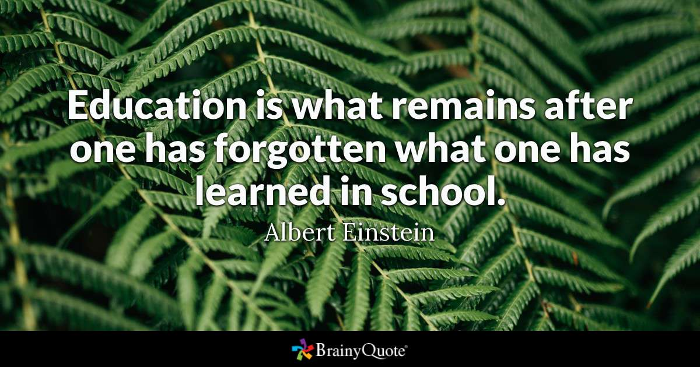

# 1.2.001 人生每一刻,皆是0到1---《从0到1》读后感

最近看到两则新闻，一是特斯拉要在上海和柏林相继建厂，二是特斯拉的市值已经超过从百年通用和福特成为美国市值最高的车企。这让我佩服《从0到1》的作者Peter Thiel的几年前预言果然成真了。而且他也十分慧眼识珠，组成了包括埃隆马斯克在内的paypal黑帮。这个黑帮里的所有人，都创立了自己的一片天空。所以我十分推荐《从0到1》这本书，这本书不仅对创立企业有用，而且对人生也有启迪。你在做每件事之前需要想想：在人类浩淼的历史长河中，你的这件事，如同一句话所说的是复读机，不断重复从1到2，到3...n，只是一个不断繁殖重复的过程，还是跳出这个逻辑，重新开始，从0起步，打下新的一片天空。

阿隆·马斯克就是一个很好的例子，他如果一直延续着paypal的路--这个已经是0到1的企业--最多就是把paypal做成美国的阿里巴巴或者支付宝。但是，对他们这样的创客而言，把一做到无限大，对他们来说，没有一点吸引力。他看见的是人类被速度和天空所限制，所以他要去创立特斯拉和spaceX这样的公司，重塑人类的想象力。这条路对于这位钢铁侠来说，又重新从零开始面对，面对不同领域，面对不同学科，面对我们人类的极限，想象力的极限以及自然界的极限。我十分钦佩他，他是乔布斯之后，另外一个能够改变人类命运的伟人。单单特斯拉的电池以及无人驾驶这些技术就将极大地改变人类的交通环境，我们生活在一个更加畅通，干净的环境。这是对人类巨大的贡献。

世界上许多人受到了0-1这种思想的影响，而且他们无一例外（包括埃隆马斯克、比尔盖茨，扎克伯格，乔布斯）都是名校的辍学生。他们在求学这条从一到n的路上，可能预见到如果沿着这条路走下去，他们也许只能和众多的博士生一样，泯然众人。但他们辍学以后，自己创办企业，从零开始，才发现了人生无限的可能，这也让我们思考一个问题，教育到底和学校有什么关系？爱因斯坦曾说过：“Education is what remains after one has forgotten what one has learned in school.”（教育是忘掉学校所教授的一切后所剩下的东西。）

片面地理解（_从另一方面讲，爱因斯坦是在告诉我们，学校不能只教知识，学生被动地学。_），我觉得虽然这很极端，但部分同意学校束缚了天才。学校只会教你已有的课程，让你学会掌握前人的路，但学校绝不会教你如何去创业，如何去走前人没有探索的路。因为这无从可教，需要自己去探索。所以我记得奇葩说，邱晨说过的一句话，“[我们上了太多的课，而错过了正在的人生。](http://www.iqiyi.com/v_19rv4nq0g4.html)”

所以大家都应该去读一下《从0到1》，然后想想你应该走怎样的道路。不是说沿着别人的路继续走下去，没有什么不好，但走下去的时候，不要忘记自己的方向，而且不要忘记，自己为什么要走这条路？走这条路的目的是什么？而不是成为滚滚历史滚轮碾过的一粒尘土。

其次，如果你要选择从0~1这条路。首先你需要一颗坚强的心，无论路上有多少人质疑，困惑，甚至自我怀疑，你都不能忘记自己为什么出发，以及相信自己，一定能够到达终点，这样你才可能到达那个所谓的1，甚至那个1永远都不在，你也必须永远在路上。其次，要达到所谓的1，你必须要借助他人的力量，就好像特斯拉，一个划时代的产品，但是它依然属于汽车，依然利用酷炫的外观来吸引人，而不是，完全不顾市场，不顾设计，一心只做电池。中国有很多这样的企业，可能技术比特斯拉还要好，但是他无法吸引更多的人来支持你，这样你的失败几率会很大，所以在这条路上，同时也要争取更多的人的支持。这条路一个人走已足够艰难，所以不要树立更多的敌人，而应该争取更多的友军，这样这条路你才更有可能到达终点。这也是，作者Peter Thiel在你那里怎么说里所说的，产品和宣传同样重要的一个道理。

这也是，我现在思考很多事儿的两个维度，第一，是否这件事具有创造性原创力？如果只是机械的重复的活动，尽量少做或者不做。因为这样的事儿，实在浪费时间或者只是为了生存，只有创造力的事儿才是你不断提高自我的关键所在。第二，是你要把你创造的东西分享出去，让更多人去了解，让更多的人看到你的努力，支持你，欣赏你，你才会有更大的动力走下去，以及更高的成功可能性。这就是《从0到1》给我的一些思考，大家也能从这本书上，获得自己独到的见解。

